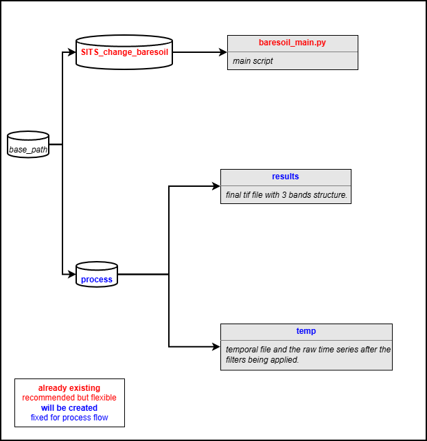

# SITS_change_baresoil

Baresoil algorithm for change detection based on FORCE Datacube.

## 1. Installing
```
conda create --name SITSclass python==3.9
conda activate SITSclass
cd /path/to/repository/SITS_classification
pip install -r requirements.txt
sudo apt-get install xterm
```

_**Notes:**_

Code is build upon FORCE-Datacube and -Framework (Docker, FORCE-Version 3.7.12)

[How to Install FORCE with Docker](https://force-eo.readthedocs.io/en/latest/setup/docker.html#docker)


## 2. Getting Started


### 2.1 Basics

This repository contains the code necessary to run change detection for Satellite Image Time Series with [bare soil Algorithm](https://geoservice.dlr.de/web/datasets/soilsuite_eur_5y) based on the [FORCE Datacube](https://force-eo.readthedocs.io/en/latest/index.html). 
It's based on the following folder structure:
<div align="center">

</div>
The bare soil algorithm is based in the spectral index PV + IR2 (bare soil index). The spectral index is calculated for the entire time series with Sentinel-2. 
The formula is as follows: 
PV + IR2 = ((NIR - RED) / (NIR + RED) + (NIR - SWIR2) / (NIR + SWIR2)).

Some filters are applied to the spectral index time series to reduce noise and outliers. The following filters are applied:
* Minimal soil count: A pixel falls into the valid mask, if it is detected three times as bare soil. This mitigates the effect of spurious outliers.
* Nir/Swir2 filter: A pixel falls into the valid mask, if the NIR/SWIR2 ratio is above or equal to 0.02.
* Threshold filter: The PV + IR2 value must be under or equal to 173 and above or equal to 1371 to be considered as valid. 

All filters are obtained from [SoilSuite Europe data description](https://geoservice.dlr.de/web/datasets/soilsuite_eur_5y).

The final result consists on a tif file with 3 bands:
* Band 1: Provides the number of bare soil occurrences over the total number of valid observation for each pixel as a percentage. 
This is calculated as the number of times a pixel is detected as bare soil divided by the total number of valid observations for that pixel. 
The resulting percentage indicates how frequently a pixel is classified as bare soil over the observed time period.
* Band 2: Provides the number of bare soil occurrences.
* Band 3: Provides the total number of valid observation for each pixel.


### 2.2 Workflow

To execute the script simply set parameters in baresoil_main and execute the file.

## Authors

* [**Sebastian Valencia**](https://github.com/Azarozo19)

## Version History

* v 1.0 - 2026-03-10

## License

GPL-3.0 license

## Acknowledgments

Inspiration, code snippets, etc.

* [FORDEAD](https://fordead.gitlab.io/fordead_package/)
* [FORCE Tutorials](https://force-eo.readthedocs.io/en/latest/howto/udf_py.html)
